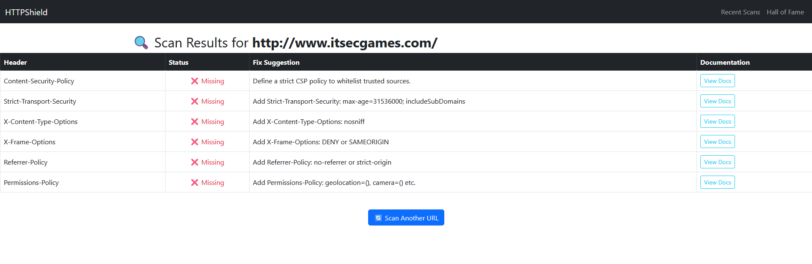
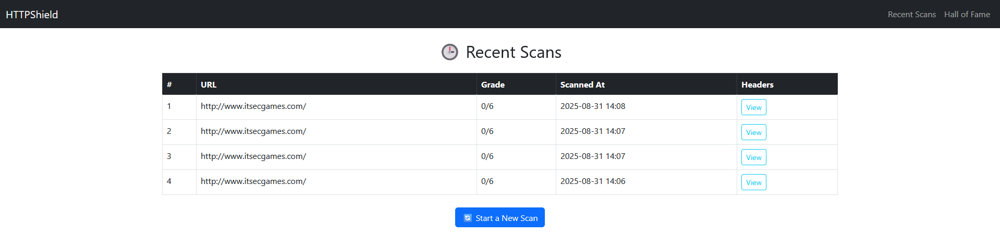

# Django-HTTP-Security-Header-Scanner
This Django-based tool scans public websites for missing HTTP security headers and provides suggestions to improve web security posture. 
## Features  
    Scans for key headers like Content-Security-Policy X-Frame-Options, etc.
    Analyze public HTTP response headers
    Grades websites based on header presence 
    Offers actionable security recommendations fix suggestions.
    View recent scans and top-performing sites

Hey! For security reasons and to stay compliant with GDPR, I can't share this project or repository publicly. But if you're serious about taking responsibility for proper data handling, send me a message and we can talk.
